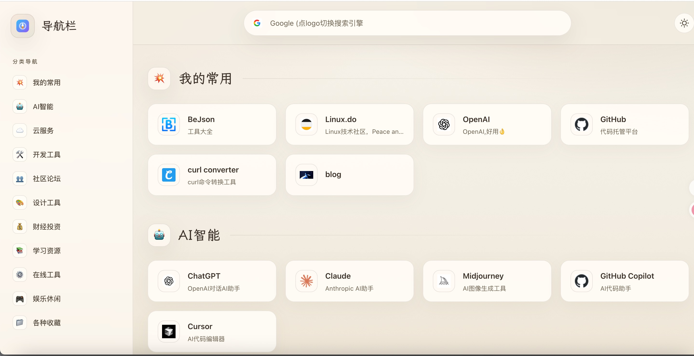

# 🐱 54320导航 (Mao Nav)

> 基于 [mao_nav](https://github.com/maodeyu180/mao_nav) 二次开发的个人导航站 —— 换上「慵懒暖阳 · 纸感」主题，支持明暗双色、分类管理与可视化后台。

[](https://opensource.org/licenses/MIT)
[](https://vuejs.org/)
[](https://vitejs.dev/)
[](https://pinia.vuejs.org/)
[](https://pages.cloudflare.com/)
[](https://github.com/maodeyu180/mao_nav)

## 🌟 本版改动（Fork 亮点）

> 本项目 Fork 自 [maodeyu180/mao_nav](https://github.com/maodeyu180/mao_nav)，在其基础上做了以下改造：

- 🎨 **全新「慵懒暖阳 · 纸感」主题** —— 米黄纸质底色 + 暖赭陶土主色（`#c17a52`）+ 柔橄榄绿点缀，叠加颗粒噪点纹理（`grain.svg`）与多层径向光晕；界面统一为大圆角、柔和阴影、慵懒缓动曲线。
- ✍️ **中文排版升级** —— 正文用思源黑体（Noto Sans SC），标题/点缀采用霞鹜文楷（LXGW WenKai）等楷体衬线，更具书卷气。
- 🌗 **重做明暗双主题** —— 独立 `useThemeStore` 管理，localStorage 记忆选择并自动跟随系统深色偏好；暗色为「暖夜 · 通透炭色」低彩度暖灰配色。
- 🏷️ **品牌自定义** —— 更新站点标题与 `favicon.svg`。
- 🛠️ **管理后台增强** —— GitHub 连接状态检测；可在线修改站点标题、切换默认搜索引擎（Google / 百度 / Bing / DuckDuckGo）、上传站点 Logo；新增环境变量与系统信息面板。
- 🧹 **首页重构** —— 大幅精简重写 `NavHomeView.vue`，结构更清晰、更易维护。

## 🛠️ 原项目更新记录

> 以下为上游项目 [mao_nav](https://github.com/maodeyu180/mao_nav) 的历史更新记录，一并保留供参考：

- 2025-07-15 完善 logo 自动获取流程。
- 2025-07-16 修复 admin 管理后台编辑相关问题，优化编辑逻辑。
- 2025-07-17 增加网站名称修改、站点 logo，调整手机端排版。
- 2025-07-22 增加站点拖拽排序，优化 icon 获取。
- 2025-07-30 修复 item 展示问题，增加环境变量 VITE_OPEN_LOCK，配置首页也需验证密码。
- 2025-08-11 增加夜间模式，增加默认搜索引擎设置功能。

## 效果预览

示例站点：[54320导航](https://xiaow.de5.net)



## ✨ 特性

- 🎨 **纸感视觉设计** - 「慵懒暖阳」暖色纸质主题，颗粒质感与柔和光晕，清爽耐看
- 🌗 **明暗双主题** - 一键切换深色/浅色，自动记忆并跟随系统偏好
- 📱 **多设备适配** - 完美支持桌面端、平板和移动端
- 🔥 **分类管理** - 支持自定义分类和网站管理，可拖拽排序
- 🔎 **多搜索引擎** - 可切换默认搜索引擎（Google / 百度 / Bing / DuckDuckGo）
- ⚡ **快速访问** - 基于 Vue 3 + Vite 构建，加载速度极快
- 🌐 **免费部署** - 支持 Cloudflare Pages / Vercel 免费部署
- 🛠️ **易于定制** - 简单的配置即可个性化你的导航
- 👨‍💻 **可视化后台** - 可选配置管理员界面，支持可视化添加/编辑分类和网站（需要 GitHub Token）

## 🚀 快速开始

图文教程可访问[54320导航图文教程](https://blog.maodeyu.fun/2025/07/16/nav_mao/)（原作者教程，部署流程通用）

### 🚀 部署到 Cloudflare（推荐）

**1. Fork 本项目**
- 点击页面右上角的 **"Fork"** 按钮
- 将项目 Fork 到你的 GitHub 账号下

**2. 在 Cloudflare Pages 控制台部署**
1. 访问 [Cloudflare Dashboard](https://dash.cloudflare.com)
2. 注册/登录 Cloudflare 账号（免费）
3. 点击左侧菜单 **"Workers & Pages"**
4. 点击 **"Create application"** → **"Pages"** → **"Connect to Git"**
5. 授权 GitHub 并选择你 Fork 的 `mao_nav` 仓库
6. 配置构建设置：
   - **Framework preset**: `Vue`
   - **Build command**: `npm run build`
   - **Build output directory**: `dist`
7.（可选）在 **Environment Variables** 里添加你的环境变量（如需用到管理员功能）
8. 点击 **"Save and Deploy"**

✅ **完成！** 几分钟后你就有了自己的导航网站，每次修改代码都会自动重新部署。

**3. 自定义你的导航**
- 编辑 `src/mock/mock_data.js` 文件，添加你自己的网站分类和链接
- 提交更改，Cloudflare 会自动重新部署

**4. 绑定自定义域名（可选）**
- 在 Cloudflare Pages 项目设置中点击 **"Custom domains"**
- 添加你的域名并按提示配置 DNS

---

### 🚀 部署到 Vercel

**1. Fork 本项目**
- 同上，先 Fork 到你的 GitHub 账号

**2. 在 Vercel 控制台部署**
1. 访问 [Vercel 官网](https://vercel.com/)
2. 注册/登录 Vercel 账号（免费）
3. 点击右上角 **"Add New"** → **"Project"**
4. 选择你 Fork 的 `mao_nav` 仓库，点击 **"Import"**
5. 保持默认设置，Vercel 会自动检测到是 Vue 项目
   - **Framework Preset**: `Vite`
   - **Build Command**: `npm run build`
   - **Output Directory**: `dist`
6. （可选）在 **Environment Variables** 里添加你的环境变量（如需用到管理员功能）
7. 点击 **"Deploy"**

✅ **完成！** 部署成功后会自动生成一个 vercel.app 域名，每次推送代码会自动重新部署。

**3. 自定义你的导航**
- 编辑 `src/mock/mock_data.js` 文件，添加你自己的网站分类和链接
- 提交更改，Vercel 会自动重新部署

**4. 绑定自定义域名（可选）**
- 在 Vercel 项目设置中点击 **"Domains"**
- 添加你的域名并按提示配置 DNS

### 🛠️ 配置管理员界面（可选）

如果你想使用管理员界面来可视化管理导航数据，可以配置 GitHub Token：

**1. 获取 GitHub Personal Access Token**

1. 访问 [GitHub Settings → Developer settings → Personal access tokens](https://github.com/settings/tokens)
2. 点击 "Generate new token" → "Generate new token (fine-grained token)"
3. 设置 Token 名称，选择过期时间，并**只选择你的 mao_nav 仓库**（这样即使 token 泄露也不会影响你其他项目）
4. 在 **Repository permissions (仓库权限)** 部分，勾选以下权限：
   - `Contents` - **Read and write** ✅
     <span style="color:#888;font-size:13px;">用于读取和修改 <code>src/mock/mock_data.js</code> 文件，这是管理系统的核心功能</span>
   - `Metadata` - **Read** ✅
     <span style="color:#888;font-size:13px;">用于访问仓库基本信息，GitHub API 的基础权限</span>
5. 在 **Account permissions (账户权限)** 部分：
   <span style="color:#888;font-size:13px;">不需要勾选任何账户权限 ❌，我们只操作特定仓库，不需要账户级别的权限</span>
6. 点击 "Generate token" 并复制生成的 Token（只显示一次）

**2. 配置环境变量**

- **如果你在 _自己的服务器_ 部署：**
  在项目根目录创建 `.env` 文件，添加以下配置：

- **如果你使用 _Vercel_ 或 _Cloudflare Pages_ 部署：**
  请在对应平台的「环境变量」设置界面，添加下方这些变量，无需在项目中创建 `.env` 文件。

```
# 管理员密钥（自定义）
VITE_ADMIN_PASSWORD=your_admin_password_here

# GitHub Token
VITE_GITHUB_TOKEN=your_github_token_here
# Github 仓库所有者
VITE_GITHUB_OWNER=your_github_owner_here
VITE_GITHUB_REPO=your_github_repo_here
VITE_GITHUB_BRANCH=your_github_branch_here
```

### 本地开发

1. **克隆项目**
```bash
git clone https://github.com/qiangwh/mao_nav.git
cd mao_nav
```

2. **安装依赖**
```bash
npm install
```

3. **启动开发服务器**
```bash
npm run dev
```

4. **打开浏览器访问** `http://localhost:5173`

### 项目结构

```
mao_nav/
├── src/
│   ├── apis/           # API 接口（GitHub / 导航数据）
│   ├── assets/         # 静态资源（图片、base.css 主题变量等）
│   ├── components/     # Vue 组件（含 admin/ 管理后台组件）
│   ├── mock/           # 导航数据（mock_data.js）
│   ├── router/         # 路由配置
│   ├── stores/         # Pinia 状态管理（含主题 store）
│   ├── views/          # 页面组件（NavHomeView / AdminView 等）
│   ├── App.vue         # 根组件
│   └── main.js         # 入口文件
├── public/             # 公共静态文件（favicon.svg / grain.svg 等）
├── index.html          # HTML 模板
├── package.json        # 项目配置
├── vite.config.js      # Vite 配置
└── wrangler.toml       # Cloudflare 部署配置
```

## 🎯 自定义配置

### 修改导航数据

有两种方式来自定义你的导航分类和网站：

**方式1：直接编辑文件（推荐）**
编辑 `src/mock/mock_data.js` 文件来自定义你的导航分类和网站：

```javascript
export const mockData = {
  categories: [
    {
      id: "my-favorites",
      name: "我的常用",
      icon: "💥",
      order: 0,
      sites: [
        {
          id: "example",
          name: "示例网站",
          url: "https://example.com",
          description: "网站描述",
          icon: "https://example.com/favicon.ico"
        }
      ]
    }
  ]
}
```

**方式2：使用管理员界面（可选）**
如果你配置了管理员界面（见上方配置说明），可以通过以下步骤可视化管理：

1. 访问 `http://localhost:5173/admin` 或 `https://your-domain.com/admin`
2. 输入管理员密钥登录
3. 在界面中添加、编辑或删除分类和网站
4. 在「系统设置」中还可在线修改站点标题、切换默认搜索引擎、上传 Logo
5. 点击"保存到 GitHub"按钮保存更改
6. 系统会自动在 2-3 分钟内重新部署

### 自定义主题与样式

- 主题变量（配色、字体、圆角、阴影）：`src/assets/base.css` 顶部的 `:root` / `.dark`
- 全局样式：`src/assets/main.css`

## 🛠️ 开发命令

```bash
# 开发模式
npm run dev

# 构建生产版本
npm run build

# 预览生产版本
npm run preview

# 代码检查和修复
npm run lint
```

## 🧰 技术栈

- **Vue 3.5** + **Vite 5** - 现代前端框架与构建工具
- **Pinia** - 状态管理（导航数据、主题）
- **Vue Router** - 路由
- **vuedraggable** - 分类/站点拖拽排序
- **GitHub API** - 可视化后台的数据持久化

## 📋 部署清单

在部署前请检查：

- [ ] 已修改 `src/mock/mock_data.js` 为你的个人数据
- [ ] 已更新 `package.json` 中的项目信息
- [ ] 已配置 Cloudflare / Vercel 账号（用于部署）
- [ ] 已测试构建命令 `npm run build`
- [ ] 已验证 `dist` 目录生成正常
- [ ] （可选）已配置管理员界面的环境变量

## 🤝 贡献

欢迎提交 Issue 和 Pull Request！

1. Fork 本项目
2. 创建你的特性分支 (`git checkout -b feature/AmazingFeature`)
3. 提交你的修改 (`git commit -m 'Add some AmazingFeature'`)
4. 推送到分支 (`git push origin feature/AmazingFeature`)
5. 打开一个 Pull Request

## 📄 许可证

本项目基于 MIT 许可证开源 - 查看 [LICENSE](LICENSE) 文件了解详情

## 🙏 致谢

- **上游项目**：[maodeyu180/mao_nav](https://github.com/maodeyu180/mao_nav) —— 本项目在其基础上二次开发，感谢原作者的开源工作 🎉
- [Vue.js](https://vuejs.org/) - 渐进式 JavaScript 框架
- [Vite](https://vitejs.dev/) - 下一代前端构建工具
- [Pinia](https://pinia.vuejs.org/) - Vue.js 状态管理库
- [Cloudflare Pages](https://pages.cloudflare.com/) - 现代化的 JAMstack 平台
- [霞鹜文楷 LXGW WenKai](https://github.com/lxgw/LxgwWenKai) - 开源中文字体

## 📞 联系方式

如果你有任何问题或建议，欢迎通过以下方式联系：

- 提交 [Issue](https://github.com/qiangwh/mao_nav/issues)
- 发起 [Discussion](https://github.com/qiangwh/mao_nav/discussions)

---

⭐ 如果这个项目对你有帮助，请给它一个 Star！
